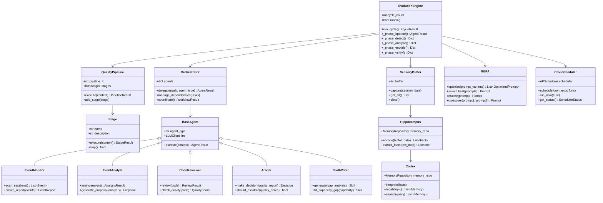
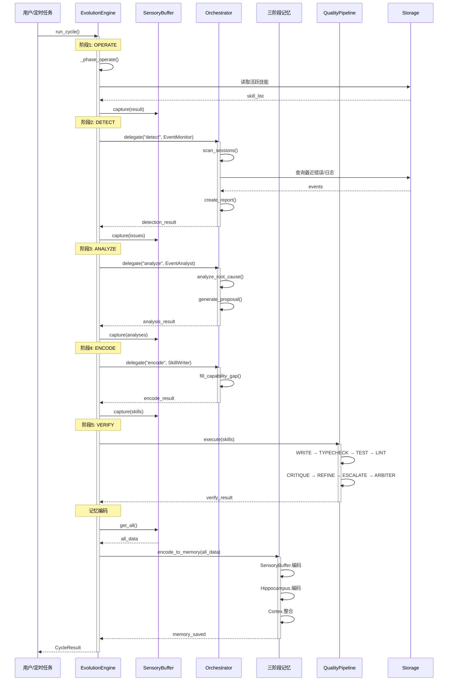
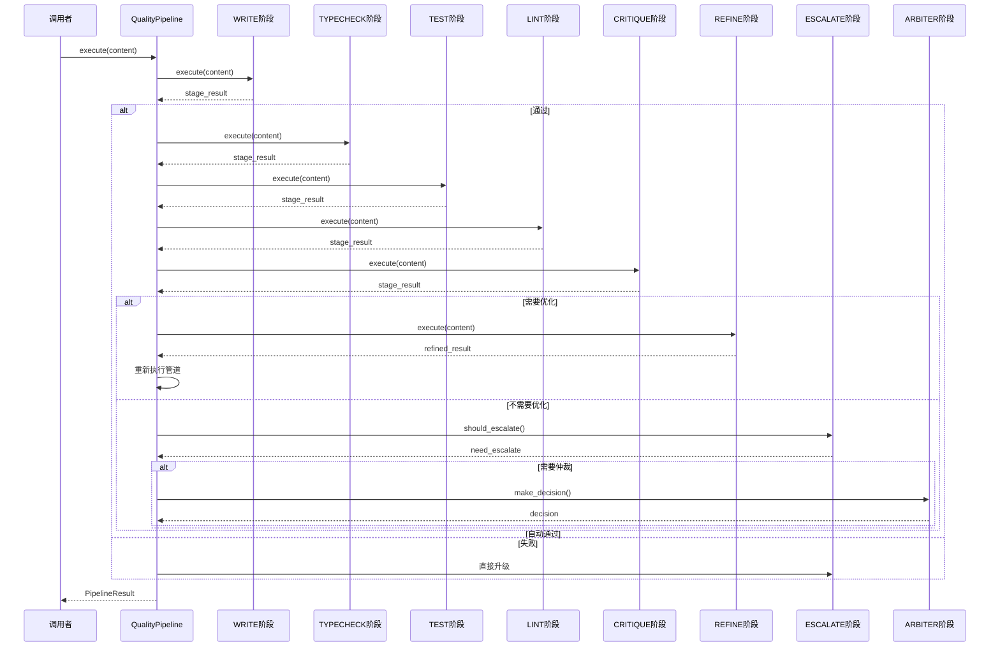
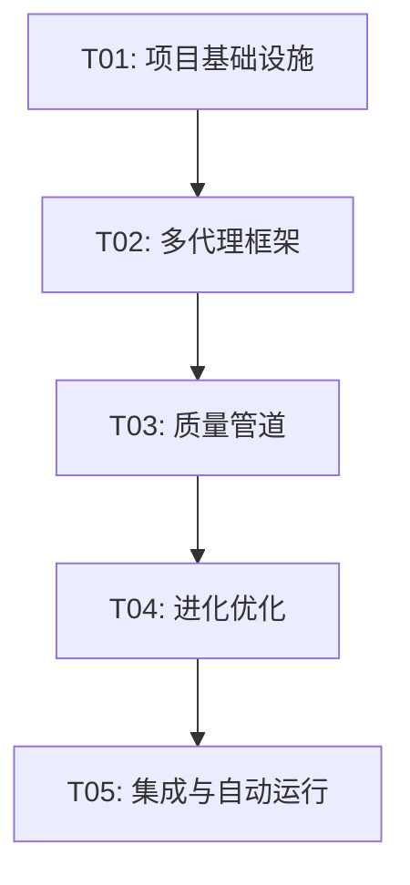

# WorkBuddy 自我进化系统 - 架构设计文档

## 一、项目概述

| 属性 | 内容 |
|------|------|
| 项目名称 | perfect_self_evolution_system |
| 编程语言 | Python 3.13 |
| 项目路径 | C:\Users\Administrator\WorkBuddy\Claw\evolution |
| 架构版本 | v1.0 |
| 设计日期 | 2026-06-21 |

---

## 二、实现方案与框架选型

### 2.1 技术栈

| 组件 | 选型 | 理由 |
|------|------|------|
| **核心框架** | Python 3.13 + asyncio | 高性能异步处理，支持原生协程 |
| **LLM客户端** | OpenAI API / Anthropic API | 灵活切换，支持多模型 |
| **定时任务** | APScheduler | 功能完善，支持多种调度策略 |
| **存储** | SQLite + JSON文件 | 轻量级，无需外部服务 |
| **日志** | Python logging + loguru | 结构化日志，支持多输出 |
| **配置** | Pydantic Settings | 类型安全，支持环境变量 |
| **代码质量** | flake8 + mypy + pytest | 静态检查 + 单元测试 |

### 2.2 架构模式

采用**分层架构 + 事件驱动**模式：

```
┌─────────────────────────────────────────────────────────┐
│                    Presentation Layer                    │
│         (CLI/API入口, 定时任务触发, 日志输出)              │
└─────────────────────────────────────────────────────────┘
                            │
                            ▼
┌─────────────────────────────────────────────────────────┐
│                   Orchestration Layer                    │
│           (多代理协调器, 任务编排, 流程控制)               │
└─────────────────────────────────────────────────────────┘
                            │
        ┌───────────────────┼───────────────────┐
        ▼                   ▼                   ▼
┌─────────────┐     ┌─────────────┐     ┌─────────────┐
│Agent Layer  │     │  Core Loop  │     │   Quality   │
│(7种代理)    │     │  (5阶段)    │     │  Pipeline   │
└─────────────┘     └─────────────┘     └─────────────┘
        │                   │                   │
        └───────────────────┼───────────────────┘
                            ▼
┌─────────────────────────────────────────────────────────┐
│                     Memory Layer                         │
│         (感觉缓冲区 → 海马编码 → 皮层整合)                │
└─────────────────────────────────────────────────────────┘
                            │
                            ▼
┌─────────────────────────────────────────────────────────┐
│                    Storage Layer                         │
│          (SQLite数据库, JSON配置, 文件存储)              │
└─────────────────────────────────────────────────────────┘
```

### 2.3 核心挑战与解决方案

| 挑战 | 解决方案 |
|------|----------|
| 循环执行的正确性 | 5阶段状态机 + 事务性存储 |
| 错误捕获的完整性 | 多层try-catch + 事件总线统一收集 |
| 多代理协作 | 编排器统一调度 + 事件驱动异步通信 |
| 质量保障 | 8阶段管道串行执行，每阶段可跳过 |
| 自动运行 | APScheduler定时任务 + 守护进程模式 |
| 成本控制 | 单次循环预算限制 + token计数 |

---

## 三、文件列表

### 3.1 完整文件结构

```
C:\Users\Administrator\WorkBuddy\Claw\evolution\
├── docs/                          # 文档目录
│   ├── system_design.md           # 本文档
│   ├── class-diagram.mermaid      # 类图
│   └── sequence-diagram.mermaid   # 时序图
│
├── config/                        # 配置层
│   ├── __init__.py
│   ├── config.py                  # 配置管理
│   ├── constants.py               # 常量定义
│   └── prompts.py                 # 提示词模板
│
├── core/                          # 核心引擎层
│   ├── __init__.py
│   ├── engine.py                  # 5阶段进化循环引擎 [已有]
│   ├── evolution_loop.py          # 进化循环入口
│   ├── quality_pipeline.py        # 8阶段质量管道
│   ├── event_bus.py               # 事件总线 [已有]
│   └── constants.py               # 阶段/状态常量 [已有]
│
├── agents/                        # 多代理协作层
│   ├── __init__.py
│   ├── orchestrator.py            # 任务编排器
│   ├── event_monitor.py           # 事件监控器
│   ├── event_analyst.py           # 事件分析师
│   ├── code_reviewer.py           # 代码质量评审
│   ├── arbiter.py                 # 质量仲裁者
│   ├── skill_writer.py            # 技能编写器
│   └── token_optimizer.py         # Token优化器
│
├── memory/                        # 记忆系统层
│   ├── __init__.py
│   ├── three_stage.py             # 三阶段记忆 [已有]
│   ├── sensory_buffer.py          # 感觉缓冲区（独立模块）
│   ├── hippocampus.py             # 海马编码（独立模块）
│   └── cortex.py                  # 皮层整合（独立模块）
│
├── skills/                        # 技能系统层
│   ├── __init__.py
│   ├── skill_generator.py         # 技能生成管道
│   ├── skill_registry.py          # 技能注册表
│   └── templates/                 # 技能模板
│       ├── __init__.py
│       ├── base_skill.py          # 基础技能类
│       └── common_skills.py       # 通用技能
│
├── evolution/                     # 进化优化层
│   ├── __init__.py
│   ├── gepa.py                    # GEPA提示词优化
│   ├── self_reflection.py         # 自我反思机制
│   └── prompt_optimizer.py        # 提示词优化器
│
├── scheduler/                     # 调度层
│   ├── __init__.py
│   ├── job_scheduler.py           # 任务调度器 [已有]
│   ├── cron_manager.py            # Cron管理
│   └── health_check.py            # 健康检查
│
├── storage/                       # 存储层
│   ├── __init__.py
│   ├── database.py                # 数据库连接 [已有]
│   ├── models.py                  # 数据模型 [已有]
│   └── repositories.py            # 仓储层 [已有]
│
├── quality/                       # 质量保障层
│   ├── __init__.py
│   ├── pipeline_stages.py         # 管道各阶段实现
│   ├── reviewers/                 # 评审器
│   │   ├── __init__.py
│   │   ├── type_checker.py        # 类型检查
│   │   ├── test_runner.py         # 测试运行
│   │   ├── linter.py              # 代码检查
│   │   └── critic.py              # 批判性评审
│   └── arbiter_decisions.py       # 仲裁决策
│
├── utils/                         # 工具层
│   ├── __init__.py
│   ├── logger.py                  # 日志工具 [已有]
│   ├── llm_client.py              # LLM客户端 [已有]
│   ├── token_counter.py           # Token计数
│   └── cost_tracker.py            # 成本追踪
│
├── main.py                        # 主入口 [已有]
├── quick_evolution.py             # 快速进化 [已有]
├── ai_self_evolver.py             # AI自进化器 [已有]
├── auto_verify.py                 # 自动验证 [已有]
│
├── requirements.txt               # 依赖列表
├── setup_auto_start.ps1           # 自动启动脚本 [已有]
├── start_evolution.bat            # 启动脚本 [已有]
└── .env.example                   # 环境变量示例 [已有]
```

---

## 四、数据结构与接口设计

### 4.1 核心类图



### 4.2 核心数据结构

#### 4.2.1 进化循环结果

```python
@dataclass
class CycleResult:
    """进化周期执行结果"""
    cycle_id: int                      # 周期ID
    success: bool                      # 是否成功
    phases_completed: List[Phase]      # 完成的阶段
    events_created: int                # 创建的事件数
    skills_improved: int               # 改进的技能数
    quality_score: float               # 质量评分 (0-10)
    duration: float                    # 执行耗时(秒)
    errors: List[str] = field(default_factory=list)
    improvements: List[Dict] = field(default_factory=list)
```

#### 4.2.2 质量管道结果

```python
@dataclass
class PipelineResult:
    """质量管道执行结果"""
    pipeline_id: str
    overall_score: float               # 综合评分
    stage_results: Dict[str, StageResult]
    passed: bool                       # 是否通过
    escalation_needed: bool            # 是否需要升级
    arbiter_decision: str              # 仲裁决定
    suggestions: List[str] = field(default_factory=list)

@dataclass
class StageResult:
    """单阶段执行结果"""
    stage_name: str
    passed: bool
    score: float
    output: str
    duration_ms: int
    error: str = None
```

#### 4.2.3 代理结果

```python
@dataclass
class AgentResult:
    """代理执行结果"""
    agent_type: str
    success: bool
    data: Dict[str, Any]               # 业务数据
    message: str                       # 结果描述
    tokens_used: int = 0               # 消耗的token
    cost_usd: float = 0.0              # 消耗的成本
```

#### 4.2.4 事件结构

```python
@dataclass
class EvolutionEvent:
    """进化事件"""
    id: Optional[int]
    event_type: EventType              # 事件类型枚举
    phase: Phase                       # 所属阶段
    severity: Severity                 # 严重程度
    description: str                   # 描述
    context: Dict[str, Any]            # 上下文数据
    timestamp: datetime = field(default_factory=datetime.now)
    metadata: str = ""                 # JSON元数据
```

---

## 五、程序调用流程

### 5.1 主循环时序图



### 5.2 质量管道流程



---

## 六、待明确事项

| 序号 | 问题 | 优先级 | 建议方案 |
|------|------|--------|----------|
| Q1 | 系统运行频率 | 高 | 建议每日凌晨2点运行一次完整循环 |
| Q2 | 人工审查PR触发条件 | 高 | 高风险技能(risk_level="high")必须人工审查 |
| Q3 | 每月运行成本上限 | 中 | 建议$100/月，单次循环预算$2-10 |
| Q4 | API Key管理 | 中 | 使用环境变量OPENAI_API_KEY/ANTHROPIC_API_KEY |
| Q5 | 错误告警渠道 | 低 | 默认写入日志，可配置Webhook推送 |
| Q6 | 历史记录保留策略 | 低 | 建议保留90天，超期自动归档 |
| Q7 | 多实例部署 | 低 | 初期单实例，后续可扩展为分布式 |

---

## 七、任务列表

### 7.1 依赖包列表

```txt
# 核心依赖
python-dotenv==1.0.0        # 环境变量管理
apscheduler==3.10.4         # 定时任务调度
requests==2.31.0            # HTTP请求
pydantic==2.9.0             # 数据验证
pydantic-settings==2.5.0    # 配置管理

# LLM客户端
openai==1.50.0              # OpenAI API (如需)

# 代码质量工具 (开发/测试)
pytest==8.3.0               # 单元测试
pytest-asyncio==0.24.0      # 异步测试
flake8==7.1.0               # 代码风格检查
mypy==1.11.0                # 类型检查
black==24.8.0               # 代码格式化

# 可选依赖
loguru==0.7.2               # 增强日志
tiktoken==0.7.0             # Token计数
```

### 7.2 任务依赖图



### 7.3 详细任务列表

| 任务ID | 任务名称 | 源文件 | 依赖 | 优先级 | 描述 |
|--------|---------|--------|------|--------|------|
| **T01** | 项目基础设施 | `config/*.py`, `utils/*.py`, `storage/*.py`, `core/constants.py` | - | P0 | 完善配置管理、日志、LLM客户端、存储层、核心常量 |
| **T02** | 多代理框架 | `agents/*.py` | T01 | P0 | 实现7种代理：编排器、事件监控器、事件分析师、代码评审员、仲裁者、技能编写器、Token优化器 |
| **T03** | 质量管道 | `quality/*.py`, `core/quality_pipeline.py` | T02 | P0 | 实现8阶段质量管道：WRITE→TYPECHECK→TEST→LINT→CRITIQUE→REFINE→ESCALATE→ARBITER |
| **T04** | 进化优化 | `evolution/*.py`, `skills/*.py` | T03 | P1 | 实现GEPA提示词优化、自我反思机制、技能生成管道 |
| **T05** | 集成与自动运行 | `scheduler/*.py`, `main.py`, `quick_evolution.py` | T04 | P1 | 完善定时任务、健康检查、主入口集成、CLI命令 |

### 7.4 任务详细说明

#### T01: 项目基础设施
**源文件列表:**
- `config/config.py` - 配置管理（Env配置）
- `config/constants.py` - 常量定义（补充阶段枚举）
- `config/prompts.py` - 提示词模板
- `utils/logger.py` - 日志工具（增强）
- `utils/llm_client.py` - LLM客户端（完善错误处理）
- `utils/token_counter.py` - Token计数工具
- `utils/cost_tracker.py` - 成本追踪工具
- `storage/database.py` - 数据库连接
- `storage/models.py` - 数据模型（补充枚举）
- `storage/repositories.py` - 仓储层

**任务描述:**
- 完善Pydantic Settings配置管理
- 补充Phase/Status/Severity/EventType枚举
- 统一日志格式，增加结构化输出
- 完善LLM客户端的异常处理和重试机制
- 实现Token计数和成本追踪

---

#### T02: 多代理框架
**源文件列表:**
- `agents/__init__.py` - 代理注册
- `agents/orchestrator.py` - 任务编排器
- `agents/event_monitor.py` - 事件监控器
- `agents/event_analyst.py` - 事件分析师
- `agents/code_reviewer.py` - 代码评审员
- `agents/arbiter.py` - 质量仲裁者
- `agents/skill_writer.py` - 技能编写器
- `agents/token_optimizer.py` - Token优化器
- `agents/base.py` - 基础代理类

**任务描述:**
- 实现BaseAgent抽象基类，定义代理接口
- 实现Orchestrator：任务分发、依赖管理、结果聚合
- 实现EventMonitor：扫描会话、捕获错误、生成报告
- 实现EventAnalyst：根因分析、模式识别、生成改进提案
- 实现CodeReviewer：代码质量评审、问题识别
- 实现Arbiter：质量仲裁决策、是否升级判断
- 实现SkillWriter：技能生成、能力差距填补
- 实现TokenOptimizer：Token使用优化

---

#### T03: 质量管道
**源文件列表:**
- `core/quality_pipeline.py` - 质量管道入口
- `quality/pipeline_stages.py` - 各阶段实现
- `quality/__init__.py` - 管道注册
- `quality/reviewers/type_checker.py` - 类型检查器
- `quality/reviewers/test_runner.py` - 测试运行器
- `quality/reviewers/linter.py` - 代码检查器
- `quality/reviewers/critic.py` - 批判性评审
- `quality/arbiter_decisions.py` - 仲裁决策逻辑

**任务描述:**
- 实现QualityPipeline：8阶段串行执行
- 实现WRITE阶段：内容生成
- 实现TYPECHECK阶段：类型检查（mypy集成）
- 实现TEST阶段：单元测试执行
- 实现LINT阶段：代码风格检查（flake8集成）
- 实现CRITIQUE阶段：AI批判性评审
- 实现REFINE阶段：内容优化重试
- 实现ESCALATE阶段：升级判断
- 实现ARBITER阶段：最终仲裁决策

---

#### T04: 进化优化
**源文件列表:**
- `evolution/gepa.py` - GEPA提示词优化
- `evolution/self_reflection.py` - 自我反思
- `evolution/prompt_optimizer.py` - 提示词优化
- `skills/skill_generator.py` - 技能生成管道
- `skills/skill_registry.py` - 技能注册表
- `skills/templates/base_skill.py` - 基础技能类
- `skills/templates/common_skills.py` - 通用技能

**任务描述:**
- 实现GEPA算法：变体生成、变异、交叉、选择
- 实现自我反思机制：历史总结、经验提取
- 实现提示词优化：模板管理、版本控制
- 实现技能生成管道：差距检测→评估→生成→验证→部署
- 实现技能注册表：技能发现、版本管理
- 预置常用技能模板

---

#### T05: 集成与自动运行
**源文件列表:**
- `scheduler/cron_manager.py` - Cron管理
- `scheduler/health_check.py` - 健康检查
- `main.py` - 主入口（完善）
- `quick_evolution.py` - 快速进化脚本
- `cli/__init__.py` - CLI命令注册
- `cli/commands.py` - CLI命令实现

**任务描述:**
- 实现CronManager：定时任务配置
- 实现HealthCheck：系统健康检查
- 完善main.py：命令行入口、参数解析
- 完善quick_evolution.py：快速执行单次循环
- 实现CLI命令：start, stop, status, run-now, config
- 配置系统服务（Windows/Linux）

---

## 八、共享知识

### 8.1 API响应格式

所有LLM调用和内部接口统一使用以下格式：

```python
# 响应格式
{
    "code": 0,           # 0=成功, 非0=失败
    "data": {...},       # 业务数据
    "message": "描述"    # 消息
}

# AgentResult
{
    "success": bool,
    "data": Dict[str, Any],
    "message": str,
    "tokens_used": int,
    "cost_usd": float
}
```

### 8.2 日期时间规范

- 所有日期存储为 **ISO 8601 UTC** 格式
- 日志时间使用 `datetime.now(timezone.utc).isoformat()`
- 数据库时间戳使用 `datetime.now`

### 8.3 错误处理原则

1. **捕获所有异常**：每个阶段必须有try-catch
2. **记录完整上下文**：错误信息包含stack trace
3. **降级策略**：单阶段失败不影响其他阶段
4. **告警阈值**：连续3次失败触发告警

### 8.4 命名规范

| 类型 | 规范 | 示例 |
|------|------|------|
| 类名 | PascalCase | `EvolutionEngine` |
| 函数名 | snake_case | `run_cycle()` |
| 常量 | UPPER_SNAKE_CASE | `PHASE_OPERATE` |
| 文件名 | snake_case.py | `evolution_loop.py` |
| 数据库表 | snake_case | `execution_logs` |

### 8.5 日志级别

| 级别 | 使用场景 |
|------|----------|
| DEBUG | 详细调试信息 |
| INFO | 正常业务流程 |
| WARNING | 可恢复的异常 |
| ERROR | 需要关注的错误 |
| CRITICAL | 系统级故障 |

---

## 九、验收标准

### 阶段1：核心循环搭建（第1-2周）

| 验收项 | 验收标准 | 对应任务 |
|--------|---------|---------|
| 核心循环 | OPERATE→DETECT→ANALYZE→ENCODE→VERIFY五阶段可独立运行 | T01, T02 |
| 错误捕获 | 能捕获执行过程中的异常并生成事件报告 | T01, T02 |
| 记忆存储 | 三阶段记忆可存储和检索数据 | T01 |
| 代码可运行 | `python main.py run-cycle` 无报错完成单次循环 | T01, T02 |

### 阶段2：多代理与质量管道（第3-4周）

| 验收项 | 验收标准 | 对应任务 |
|--------|---------|---------|
| 多代理框架 | 7种代理类型可实例化并接收任务 | T02 |
| 质量管道 | 8阶段管道完整执行，输出质量评分 | T03 |
| 人工审查 | 支持生成候选并等待审查结果 | T03 |
| 集成测试 | 多代理协作测试通过 | T02, T03 |

### 阶段3：自动运行与优化（第5-6周）

| 验收项 | 验收标准 | 对应任务 |
|--------|---------|---------|
| 定时任务 | Cron任务可配置，系统按计划自动运行 | T05 |
| GEPA优化 | 提示词优化算法生效，输出优化变体 | T04 |
| 技能生成 | 检测到能力差距时自动生成新技能 | T04 |
| 自我反思 | 错误教训被记录并用于后续优化 | T04 |

### 阶段4：稳定运行与调优（第7-8周）

| 验收项 | 验收标准 | 对应任务 |
|--------|---------|---------|
| 无人值守 | 连续7天自动运行无人工干预 | T05 |
| 成本控制 | 每次优化成本在$2-10范围内 | T01 |
| 性能指标 | 单次循环执行时间<5分钟 | T01, T02 |
| 进化效果 | 系统能力随运行时间提升（可测量） | T04 |

---

## 十、附录

### A. 核心枚举定义

```python
from enum import Enum

class Phase(str, Enum):
    """进化循环阶段"""
    OPERATE = "OPERATE"
    DETECT = "DETECT"
    ANALYZE = "ANALYZE"
    ENCODE = "ENCODE"
    VERIFY = "VERIFY"

class Status(str, Enum):
    """执行状态"""
    PENDING = "pending"
    RUNNING = "running"
    SUCCESS = "success"
    FAILED = "failed"
    SKIPPED = "skipped"

class Severity(str, Enum):
    """严重程度"""
    DEBUG = "debug"
    INFO = "info"
    WARNING = "warning"
    ERROR = "error"
    CRITICAL = "critical"

class EventType(str, Enum):
    """事件类型"""
    TASK_START = "task_start"
    TASK_END = "task_end"
    ERROR = "error"
    IMPROVEMENT = "improvement"
    QUALITY_CHECK = "quality_check"
    DEPLOYMENT = "deployment"
```

### B. 数据库表结构

```sql
-- 事件表
CREATE TABLE events (
    id INTEGER PRIMARY KEY AUTOINCREMENT,
    event_type VARCHAR(50) NOT NULL,
    phase VARCHAR(20),
    severity VARCHAR(20),
    description TEXT,
    context TEXT,
    created_at TIMESTAMP DEFAULT CURRENT_TIMESTAMP
);

-- 记忆表
CREATE TABLE memories (
    id INTEGER PRIMARY KEY AUTOINCREMENT,
    topic VARCHAR(100),
    content TEXT,
    memory_type VARCHAR(50),
    importance FLOAT DEFAULT 0.5,
    access_count INTEGER DEFAULT 0,
    last_accessed TIMESTAMP,
    created_at TIMESTAMP DEFAULT CURRENT_TIMESTAMP
);

-- 技能表
CREATE TABLE skills (
    id INTEGER PRIMARY KEY AUTOINCREMENT,
    name VARCHAR(100) NOT NULL,
    description TEXT,
    content TEXT,
    skill_type VARCHAR(50),
    risk_level VARCHAR(20),
    status VARCHAR(20),
    validation_result TEXT,
    created_at TIMESTAMP DEFAULT CURRENT_TIMESTAMP,
    applied_at TIMESTAMP
);

-- 执行日志表
CREATE TABLE execution_logs (
    id INTEGER PRIMARY KEY AUTOINCREMENT,
    phase VARCHAR(20),
    action VARCHAR(100),
    result TEXT,
    details TEXT,
    status VARCHAR(20),
    duration_ms INTEGER,
    created_at TIMESTAMP DEFAULT CURRENT_TIMESTAMP
);
```

---

**文档版本**: v1.0
**创建日期**: 2026-06-21
**架构师**: 高见远
**审核状态**: 待审核